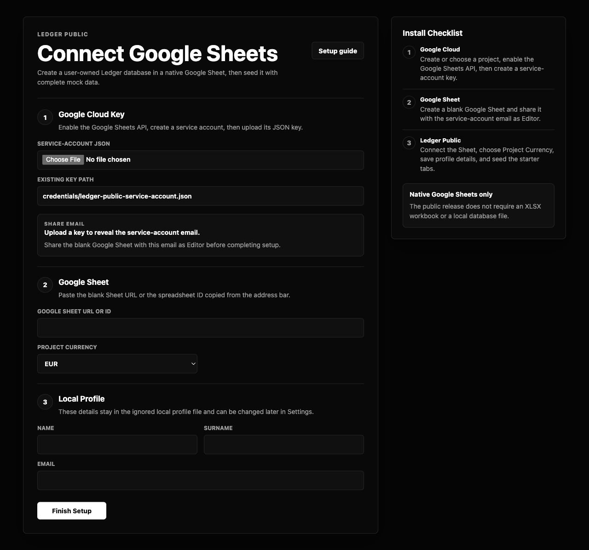
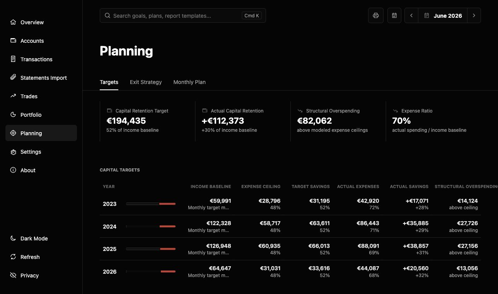

# Ledger Public

Ledger Public is the shareable version of Ledger. It uses the same UI and core logic as the private Ledger app, but each user connects their own Google Sheet and service-account JSON.

No private data, real spreadsheet ID, `.env`, or credentials are included.

## Quick Start

1. Download or clone this repository.
2. Create a blank Google Sheet in your Google Drive.
3. In Google Cloud, enable the Google Sheets API and create a service-account JSON key.
4. Double-click `start_ledger_public.command`.
5. Follow the browser setup wizard at `http://127.0.0.1:8765/setup`.

The launcher will:

- Pull the latest app version when this folder is a git clone.
- Install Google Sheets requirements when missing.
- Open a web setup page when Google Sheets is not configured.
- Ask for the service-account JSON, Google Sheet URL or ID, Project Currency, name, surname, and email.
- Seed the native Google Sheet with mock accounts, transactions, trades, portfolio plans, categories, FX rates, rules, and setup references.
- Start Ledger Public at `http://127.0.0.1:8765`.

## Starter Database

Ledger creates the starter database directly inside your native Google Sheet during setup. It seeds mock accounts, transactions, trades, portfolio plan rows, reference categories, FX rates, and classification rules without requiring XLSX upload or conversion.
Project Currency can be set during setup and changed later in Settings. Source/native rows remain stored in their original currencies.

Create a blank Google Sheet, share it with the service-account email as Editor, then paste its URL or ID into the setup page. Ledger creates the required tabs in Google Sheets format.

## Screenshots





## Why No XLSX

Ledger Public writes directly to the user's native Google Sheet through the Google Sheets API. A local XLSX workbook is not the database, is not uploaded during setup, and is not required for normal use. Runtime files such as `local_ledger_workbook.xlsx` from older builds are ignored and are not part of the public release.

## Manual Start

```bash
python3 -m pip install -r requirements-google.txt
python3 server.py --setup --open
```

Change port:

```bash
LEDGER_PORT=8770 ./start_ledger_public.command
```

## Updating

The macOS launcher runs `git pull --ff-only` automatically when the app folder is a git clone. If the repository was downloaded as a ZIP, download a fresh ZIP to update.

User data stays in the user's Google Sheet. Pulling app updates does not overwrite the Sheet or the local `.env`/credentials files.

## Local Profile

The setup page asks for name, surname, and email. Settings > Profile can edit those details later. They are stored in `.ledger_profile.json`, do not create a login, and stay on the user's computer.

## Documentation

- [INSTALL.md](INSTALL.md) - install and run instructions.
- [GOOGLE_SHEETS_SETUP.md](GOOGLE_SHEETS_SETUP.md) - detailed Google setup.
- [TROUBLESHOOTING.md](TROUBLESHOOTING.md) - common fixes.
- [SECURITY.md](SECURITY.md) - public safety rules.
- [CHANGELOG.md](CHANGELOG.md) - release history.

## Important

Do not commit private bank exports, real statement files, service-account keys, `.env`, or personal ledger data into a fork. Keep those in the user's Google Sheet or ignored local credential files.
